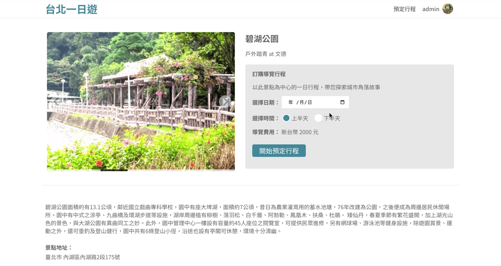
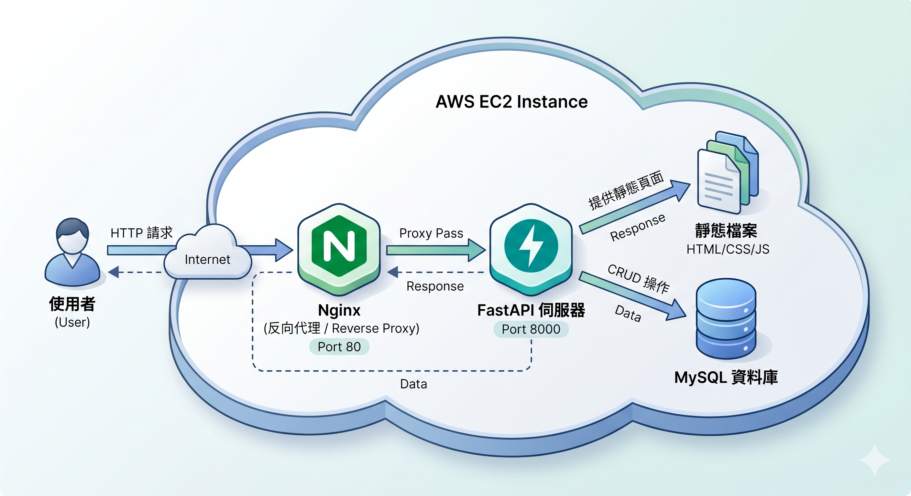
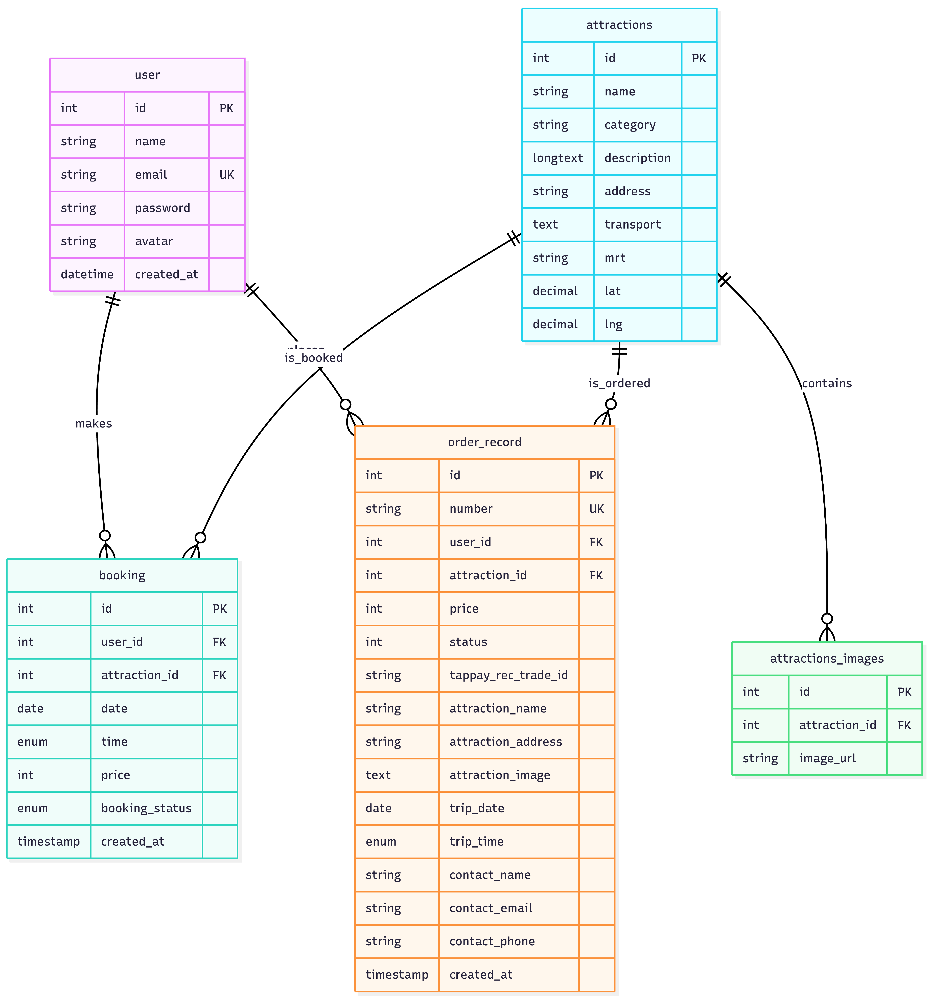

# Taipei Day Trip

[中文版 (Chinese Version)](README_zh.md)


## 📝 Summary


Taipei Day Trip is an e-commerce website designed for tourism in Taipei City. The project provides features for exploring attractions, planning itineraries, booking tour times, and integrating third-party payment services for online checkout and order creation.

**🌐 Live URL:** [http://13.237.226.245](http://13.237.226.245)

**Test Account Information:**

- Account: `admin@test.com`
- Password: `admin`

**Test Credit Card Information (TapPay):**

- Credit Card number: `4242 4242 4242 4242`
- Expiration Dates: (Any future date)
- CVV Code: `123`

## 🎥 Demo

**1. Infinite Scroll Attractions & Image Carousel**


**2. Booking, Payment, and Order Complete Flow**


**3. Member Center: Avatar Update & Order History**


## ✨ Main Features

**Attraction**

- Provides keyword and MRT station search functionality, allowing users to precisely find related attractions.
- Uses the Intersection Observer API to implement infinite scroll for dynamic loading, optimizing the page loading experience for long lists.

**Membership System**

- Implements user registration and login systems, using Regular Expressions (Regex) on the frontend to validate form input formats.
- The backend utilizes JSON Web Tokens (JWT) for user state management and API route protection.
- Provides personalized settings for members, supporting basic information updates and local image uploads for avatars.

**Booking and Payment**

- Itinerary booking system allowing users to select specific dates and times (morning/afternoon) to create pending bookings.
- Integrates TapPay third-party payment API to process credit card verification and deduction for secure online transactions.
- Order history review functionality, allowing users to view past transaction records and payment statuses on a dedicated page.

## 🛠 Techniques

### Frontend

- **Vanilla JavaScript**
- **Fetch API**
- **HTML5 / CSS3 (RWD)**

### Backend & Infrastructure

- **Python 3 / FastAPI**
- **MySQL (mysql-connector-python)**
- **JWT (JSON Web Token)**
- **bcrypt**
- **AWS EC2**
- **Nginx**

## 🏗 Architecture


The backend architecture is structured based on Separation of Concerns:

```text
├── api/             # Routing layer, handles HTTP Request and Response formats
├── core/            # Core configurations, including environment variables and JWT validation middleware
├── database/        # Database connection pool settings and initialization scripts
├── models/          # Defines API input and output data structure validation using Pydantic
├── services/        # Business logic layer, handles specific logic like password hashing and payment API requests
├── static/          # Frontend static resources (HTML / CSS / JS / Images)
└── app.py           # FastAPI application entry point and Middleware (CORS/Session) configuration
```

## 🗄 Database Schema


The database structure adopts Third Normal Form (3NF) and Data Snapshot design based on business logic requirements:

- **`user`**: Stores basic member information (name, email, hashed password, avatar path), with the email field set as `UNIQUE`.
- **`attractions`**: Stores master data of attractions (name, description, category, coordinates, etc.).
- **`attractions_images`**: Uses a foreign key to relate to the `attractions` table (many-to-one). Independent storage of attraction image URLs, conforming to Third Normal Form (3NF) to eliminate data redundancy.
- **`booking`**: Stores pending itineraries in the shopping cart. Relates to `user_id` and `attraction_id` via foreign keys, and records the itinerary date and time.
- **`order_record`**: Stores order records after checkout. This table uses a **Data Snapshot** design. At the moment an order is created, checkout information such as `attraction_name`, `attraction_address`, and images are directly copied and written into this table. This ensures that the user's historical order records are not affected by future modifications or deletions of the master `attractions` data.

## 📖 API Doc

The backend is designed with a RESTful API architecture. Thanks to the automatically generated OpenAPI specifications by FastAPI, you can visit the Swagger UI at the `/docs` route (e.g., [http://13.237.226.245/docs](http://13.237.226.245/docs)) after starting the project to view the complete API specifications and perform testing.
